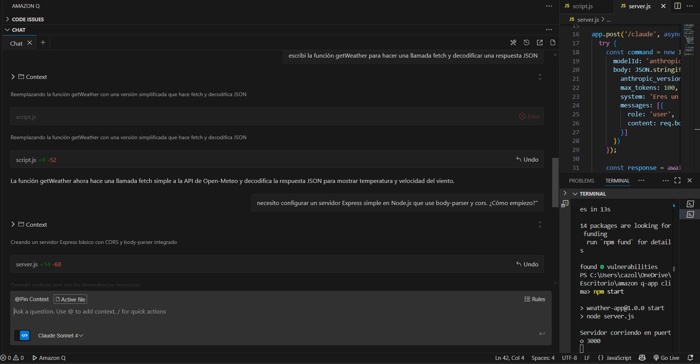
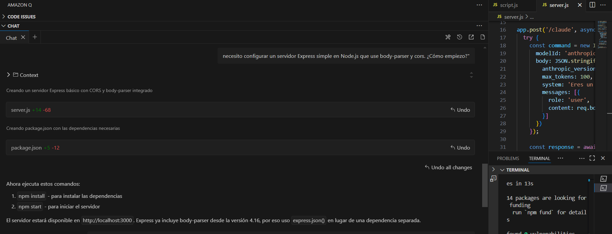
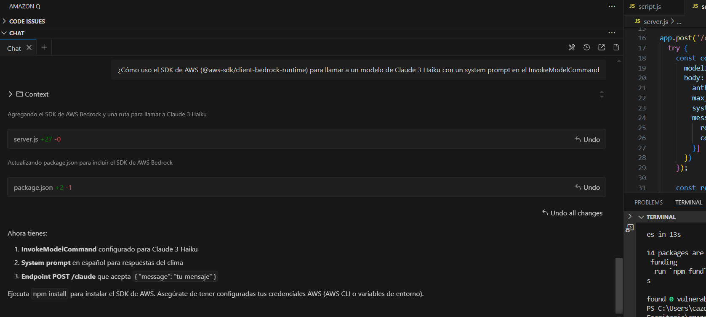

 Aplicación de Clima con Comentarios Generativos impulsados por IA!!!

Este mini proyecto para el desafio 3 de la nerdearla 2025 consiste en una Mini Aplicación Web del Clima que combina datos geográficos y meteorológicos con la capacidad de un Modelo de Lenguaje Grande (LLM) para generar comentarios contextuales. El objetivo principal de este desarrollo fue demostrar la eficiencia de Amazon Q Developer en la asistencia de código y la configuración de servicios en la nube.

El requisito central de este proyecto es usar Amazon Q Developer aceleró. A continuación, se detalla la asistencia clave proporcionada por Amazon Q Developer en el proceso de desarrollo:

Instrucciones de Ejecución:

-Requisitos: Tener instalado Node.js y configurar las credenciales de AWS en el entorno (con acceso a la región us-east-1 y permiso para invocar modelos de Bedrock).
-Instalar Dependencias: Ejecutar npm install.
-Iniciar el Servidor: Ejecutar npm start. El servidor de Node.js iniciará en http://localhost:3000.

-Acceder a la Aplicación: Abrir el archivo index.html en un navegador web y utilizar la aplicación.
